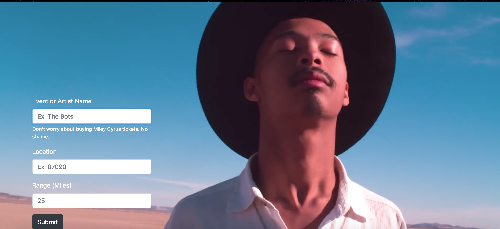
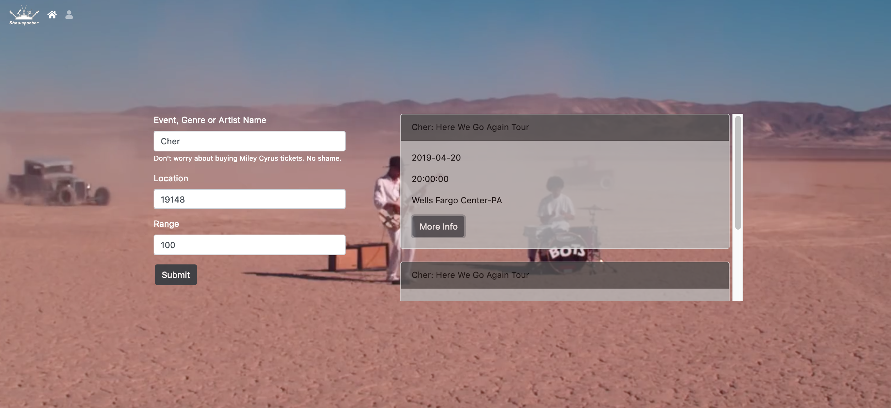
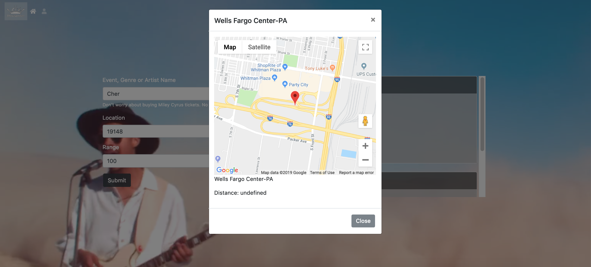

# Project One

<p align="center">

</p>


ShowSpotter - A search engine where you can find Art/Music events within a given radius. Once information is submitted through the form it will return a list of events where you can view the Event Title, Date, Time, Venue. User can create a profile page and save events, favorite bands, etc. 




### Added a modal which shows more info on returned events. Specifically a google map with a plot marker of where the Venue is for each result returned and distance.



## Team Members

* "Justin Parker" <https://github.com/Parker-Tech>
* "David M. Bedford" <https://github.com/davidmbedford>
* "Markus Maasikas" <https://github.com/estomm01>
* "Danielle Blaney" <https://github.com/DaniBlaney>

## Built With

* TicketMaster API - The api used to pull event information
* Google Distance Matrix API - The api used to show the distance and duration of travel between two points 
* Google Static API - Returns a static image of venue map
* Firebase API - Used to make profile page to save favorite bands, events, etc
* Bideo - The video background
* Bootstrap - The web framework used

## Beyond our MVP

*  Change background video with each search submitted
* Query different event APIs for things other than music related events
* Create a profile page for individual user where they can save events and favorite bands
* Use Spotify API to grab random track and play on search through audio player


--------------------------------------------------------------------------------------------------------
Before getting started, as a general rule of thumb, you should be running the commands you see within the project directory. If you experience errors, your first check should be to run `pwd` and ensure the folder name you see returned is the one you should be in.

## Install Yarn

If you have not already installed yarn, do so now.

* Windows Users: Install Yarn [here](https://yarnpkg.com/latest.msi).
* Mac Users: Using Homebrew Install Yarn like this: `brew install yarn`

## Using The Dev Environment

The first time you use this, run `yarn` in the project directory.

Now and every other time, just run `yarn start-dev`.

Visit `localhost:3000` in your chrome browser and you will see the `index.html`

With the server running you can restart it at any time by typing `rs` into the window and hitting enter.

Your files go in the following folders:

```
...
public
 --html <- html files get generated here
 --css <- put your css here
 --javascript <- put your javascript files here
 --images <- put your images here
...
```
For purposes of project one, no other folders need to be touched.

## Screen Generator

To generate a new screen for example an "about" page, you can run `yarn generate-screen -- about` in a new terminal tab and then reload the server in the previous tab with `rs` like stated above.

The result of these commands will give you an autogenerated html file in your `public/html` folder and call it `about.html`.

After a successful restart of the server you can visit your newly generated screen at `localhost:3000/about`. EZ PZ.

Obviously when you do this yourself, change the `about` to whatever you want to name your new screen.
